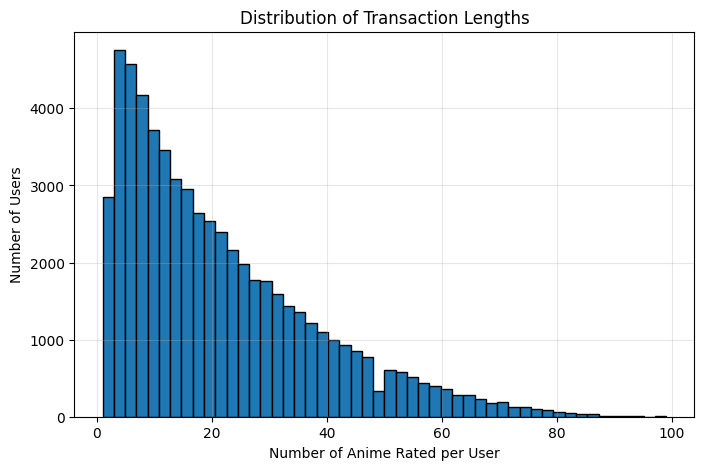
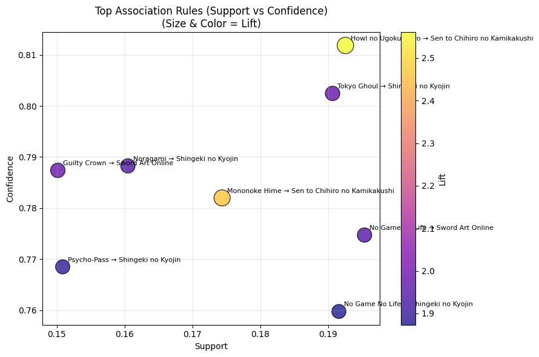

# Mining Anime Co-Watching and Recommendation Patterns Using the Apriori Algorithm

**CSC172 – Data Mining and Analysis (Final Project)**
*Mindanao State University – Iligan Institute of Technology*
**Student:** Christian Dave Janiola, 2022-0137
**Semester:** AY 2025–2026, 1st Semester

---

## Abstract

This project applies association rule mining using the Apriori algorithm to analyze anime co-watching behavior based on user rating data from the Anime Recommendations Database. User–anime rating logs are transformed into transaction-style data, where each transaction represents a user’s set of highly rated anime. Through careful preprocessing, filtering, and rule evaluation using support, confidence, and lift, the study uncovers meaningful co-watching patterns that go beyond simple popularity or sequel relationships. The resulting rules highlight shared thematic preferences, studio influence, and genre affinities, demonstrating the potential of association rule mining for recommendation systems in online media platforms.

---

## Table of Contents

1. [Introduction](#1-introduction)
2. [Dataset Description](#2-dataset-description)
3. [Methodology](#3-methodology)
4. [Results](#4-results)
5. [Discussion](#5-discussion)
6. [Conclusion](#6-conclusion)
7. [References](#7-references)

---

## 1. Introduction

### 1.1 Problem Statement

Anime streaming platforms host thousands of titles, making it difficult to understand viewer preferences and co-watching behavior without automated analysis. While recommendation systems often rely on ratings or similarity scores, these approaches may miss underlying patterns in what users tend to watch together. This project addresses the problem by applying association rule mining to discover frequent and meaningful co-watching relationships among anime titles.

### 1.2 Objectives

* Transform user rating histories into a transaction-based dataset suitable for association rule mining
* Apply the Apriori algorithm to generate frequent itemsets and association rules
* Evaluate rules using support, confidence, and lift metrics
* Interpret co-watching patterns relevant to anime recommendation systems

### 1.3 Scope and Limitations

**Scope:** The analysis focuses on positive user preferences (liked anime) using a snapshot of historical rating data.
**Limitations:** The study does not consider temporal viewing order, demographic information, or explicit genre modeling, and results are constrained by computational limits that require filtering the dataset.

---

## 2. Dataset Description

### 2.1 Source and Acquisition

* **Source:** [Anime Recommendations Database (Kaggle)](https://www.kaggle.com/datasets/CooperUnion/anime-recommendations-database)
* **Files Used:**

  * `rating.csv` – user–anime rating history
  * `anime.csv` – anime metadata (name, genre, type, episodes)

### 2.2 Data Structure

* Each row in `rating.csv` represents a user rating for a specific anime.
* Ratings of `-1` indicate watched but unrated entries and are excluded.
* Anime IDs are merged with titles from `anime.csv` for interpretability.

### 2.3 Transaction Definition

Each transaction corresponds to a single user and contains the list of anime titles that the user rated positively (rating ≥ 6). Example:

```
User 123 → ["Shingeki no Kyojin", "Tokyo Ghoul", "Psycho-Pass"]
```

---

## 3. Methodology

### 3.1 Data Preprocessing

* Removed unrated entries (rating = -1)
* Retained only positively rated anime (rating ≥ 6)
* Merged rating data with anime titles
* Filtered to the top 100 most frequently rated anime to reduce sparsity
* Grouped data by user to form transactions
* Converted transactions to one-hot encoded format using `TransactionEncoder`

After Statistics:
| Metric | Processed Data |
|--------|----------------|
| Transactions | 60,147 |
| Unique Items |  100 |

### 3.2 Exploratory Data Analysis

* Analyzed transaction length distribution to understand user activity
* Examined item frequencies to identify dominant and niche titles
* Evaluated dataset sparsity after filtering

### 3.3 Apriori Algorithm Implementation

* Applied the Apriori algorithm using `mlxtend`
* Parameters used:

  * `min_support ≥ 0.15`
  * `max_len = 2`
* Generated association rules with:

  * `confidence ≥ 0.75`
  * `lift > 1.5`

### 3.4 Rule Refinement

To avoid trivial or misleading rules:

* Prequel–sequel and franchise-based relationships were filtered using title normalization
* Rules were sorted by lift and confidence to prioritize non-random, interpretable associations

---

## 4. Results

### 4.1 Top Association Rules

| Antecedent          | Consequent                    | Support | Confidence | Lift |
| ------------------- | ----------------------------- | ------- | ---------- | ---- |
| Howl no Ugoku Shiro | Sen to Chihiro no Kamikakushi | 0.193   | 0.812      | 2.56 |
| Tokyo Ghoul         | Shingeki no Kyojin            | 0.191   | 0.802      | 1.98 |
| No Game No Life     | Sword Art Online              | 0.195   | 0.775      | 1.95 |
| Mononoke Hime       | Sen to Chihiro no Kamikakushi | 0.174   | 0.782      | 2.47 |

### 4.2 Visualization
### Transaction lenghts distribution


### Visualization of top association rules



---

## 5. Discussion

The discovered rules reveal that anime co-watching behavior is strongly influenced by shared themes, studio identity, and narrative style rather than random popularity. For example, Studio Ghibli films show particularly strong associations, while darker action-oriented series exhibit consistent overlap among viewers. By filtering out sequel relationships, the analysis focuses on genuine preference-based patterns that are useful for recommendation systems.

---

## 6. Conclusion

This project demonstrates the effectiveness of association rule mining for uncovering meaningful co-watching patterns in anime viewing data. Through careful preprocessing, strict rule selection criteria, and domain-aware filtering, the Apriori algorithm successfully identified strong and interpretable associations. These findings can inform recommendation strategies and contribute to a deeper understanding of user behavior in online media consumption.

---

## 7. Video Presentation
[](demo/CSC172_[LastName]_Final.mp4)  
*5-minute demo: Problem → Dataset → Methods → Key Findings → Business Insights*

1. Agrawal, R., & Srikant, R. (1994). Fast Algorithms for Mining Association Rules. VLDB.
2. mlxtend Documentation: [https://rasbt.github.io/mlxtend/](https://rasbt.github.io/mlxtend/)
3. Anime Recommendations Database: [https://www.kaggle.com/datasets/CooperUnion/anime-recommendations-database](https://www.kaggle.com/datasets/CooperUnion/anime-recommendations-database)

## Appendix: Full Results
**Complete rules CSV:** [results/rules_top25.csv](results/rules_top25.csv)  


